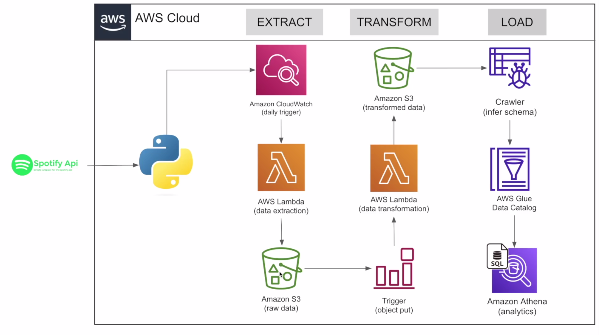

# 🎵 Spotify End-to-End Data Engineering Project

This project is an end-to-end data pipeline I built using **AWS services** and the **Spotify API**. It automatically extracts data from the **Top 100 Global Songs** playlist on Spotify, transforms it into clean, structured formats, and makes it available for analysis using Athena. The entire pipeline is fully **serverless** and runs **daily**, thanks to AWS EventBridge and Lambda.

If you're looking for a real-world example that combines cloud, automation, and data engineering — this one’s for you.

---

## 🛠️ Technologies Used

- **Spotify API** – Source of the Top 100 Global playlist data  
- **AWS Lambda** – Serverless compute to handle both extraction and transformation  
- **Amazon S3** – Stores raw JSON files and transformed CSV data  
- **Amazon EventBridge** – Schedules daily data pulls and triggers processing  
- **AWS Glue Crawler** – Automatically discovers schema and updates the data catalog  
- **AWS Glue Data Catalog** – Centralized metadata store  
- **Amazon Athena** – Run SQL queries directly on S3 data  
- **Python** – Used to write Lambda functions (`spotipy`, `boto3`, `pandas`)

---

## 🧠 Architecture Overview

---

## 📌 How the Pipeline Works

### 1. 🔍 Extract Stage

- A **Lambda function** is triggered once a day by **Amazon EventBridge**.
- It uses the **Spotify API** to pull the latest **Top 100 Global Songs** playlist.
- The raw JSON response is saved to **Amazon S3** under:  
  `raw_data/to_processed/`

---

### 2. 🔄 Transform Stage

- A **second Lambda function** is triggered when a new file is uploaded to `to_processed/`.
- This function:
  - Parses the raw JSON
  - Extracts structured data for:
    - 🎵 Songs
    - 🎙️ Artists
    - 💿 Albums
  - Converts each category into a clean **CSV**
  - Uploads the results to:
    - `transformed_data/songs_data/`
    - `transformed_data/artist_data/`
    - `transformed_data/album_data/`
  - Archives the original raw file by moving it to:  
    `raw_data/processed/`

---

### 3. 📥 Load Stage

- A **Glue Crawler** scans the `transformed_data/` folders.
- It detects schema changes and updates the **AWS Glue Data Catalog** tables.
- With the data catalog in place, the structured data is queryable in **Amazon Athena** using standard SQL.

---

## 🧾 S3 Bucket Folder Structure

spotify-etl-project-one/ │ ├── raw_data/ │ ├── to_processed/ │ └── processed/ │ └── transformed_data/ ├── album_data/ ├── artist_data/ └── songs_data/

---

## 🧑‍💻 Lambda Functions

### 🔹 Data Extraction Lambda

- Authenticates with Spotify using environment variables.
- Pulls the Top 100 Global Songs playlist.
- Dumps the full JSON data into `raw_data/to_processed/`.

### 🔹 Data Transformation Lambda

- Triggered when a new file is uploaded to `to_processed/`.
- Extracts and structures data for:
  - Albums → ID, name, release date, total tracks, URL  
  - Artists → ID, name, URL  
  - Songs → ID, name, popularity, duration, album ID, artist ID, added date, URL
- Saves the data as CSV files in respective folders under `transformed_data/`.
- Moves the raw JSON file to `raw_data/processed/`.

---

## 📅 Automation Setup

| Event                   | AWS Service            | Description                                                  |
|------------------------|------------------------|--------------------------------------------------------------|
| **Daily Extraction**    | Amazon EventBridge     | Triggers the first Lambda function every 24 hours            |
| **Transformation Trigger** | S3 Object Created Event | Triggers the second Lambda function when a file is added     |
| **Data Crawling**       | AWS Glue Crawler       | Crawls `transformed_data/` and updates the Glue Catalog      |

---

## 📊 Example Use Cases (Athena Queries)

Once the data is in Athena, you can run interesting analytics such as:

- Find the most popular songs in the current Top 100
- Count how many songs each artist has in the list
- Track how often new albums appear in the playlist
- Analyze song popularity trends over time

---

## 🧪 How to Set It Up

1. Create an **S3 bucket** with the folder structure shown above.
2. Deploy both **Lambda functions** and assign necessary IAM permissions.
3. Set up an **EventBridge rule** to trigger the extraction Lambda daily.
4. Add an **S3 trigger** to run the transformation Lambda on file upload.
5. Create a **Glue Crawler** to crawl the transformed data folders.
6. Query your structured dataset using **Amazon Athena**.

---

## 📎 About Me

**Linga Reddy Gudisha**  
🎓 Master’s in Computer Science | ☁️ AWS Certified | 📊 Data Engineering Enthusiast

